# Life Dashboard

### My first adventure into the realm of Hardware!

I got a Divoom Pixoo 64 (LED display) and coded up a dashboard of various rotating wellbeing metrics.
I'll get a Raspberry Pi one day but currently it depends on my MacBook being on.

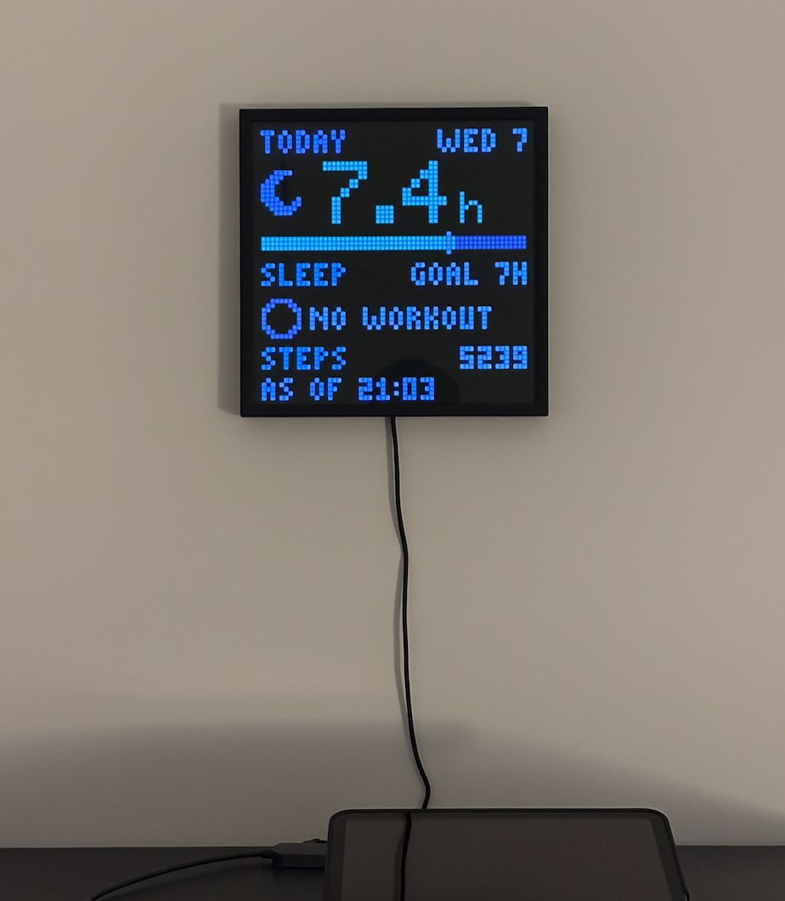

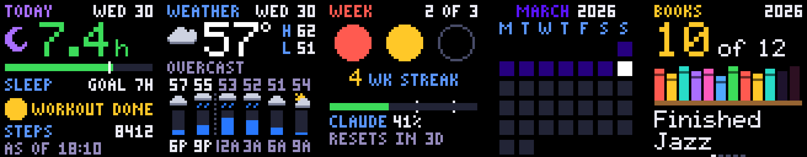

- Sleep and workout data that I linked with the iOS Health Auto Export app via REST API
- Delays for the various bus and train lines I take from the MTA alerts page
- Book progress within a year via my public Goodreads RSS feed
- Daily weather
- A monthly feature synthesizing some aspect(s) of data collection

## What it does

- Scores every workout by effort: minutes in each heart-rate zone, weighted 1 to 5. Enough load earns a dot; three dots a week is the target, and the streak counts weeks that hit it.
- Tracks daily small wins (sleep goal met, workout done, book finished), training load (acute, chronic, balance), and books read this year.
- Writes one short daily line in a balanced, wisdom-leaning voice. Rest counts as progress; nagging and streak anxiety are banned by a gate.
- Once a month, the model authors a theme, a palette, and a 16x16 pixel plate for every day, with no personal data in the request.
- Renders device-agnostic 64x64 frames and short celebration clips with Pillow; adapters only transport them to the panel or the browser.

## Screens

| Today | Week | Books |
|---|---|---|
| 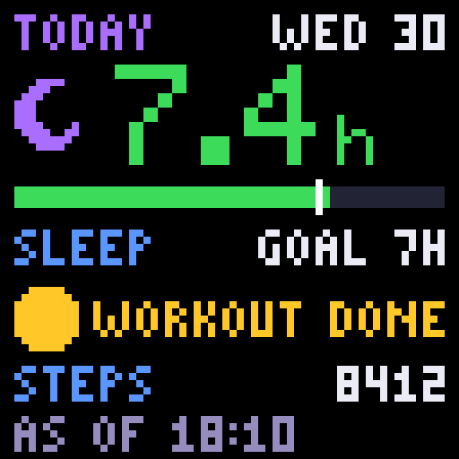 | 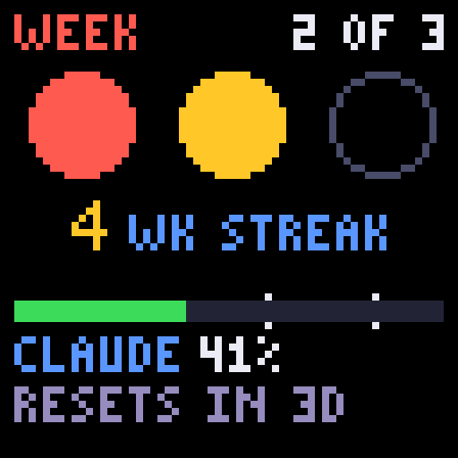 | 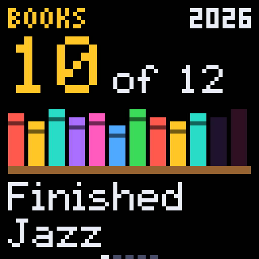 |

| Weather | Transit | Month |
|---|---|---|
| 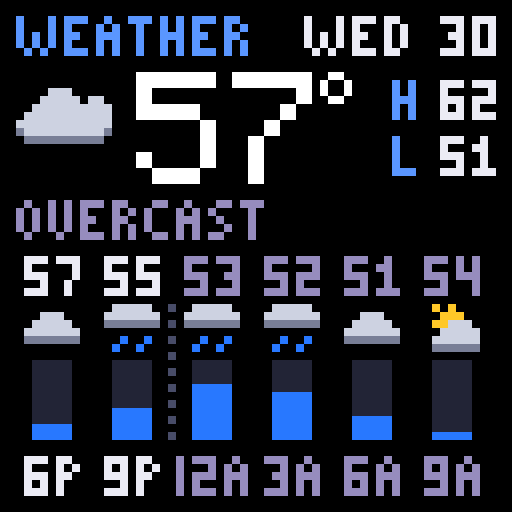 | 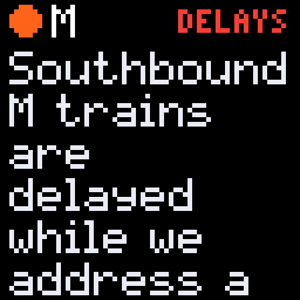 | 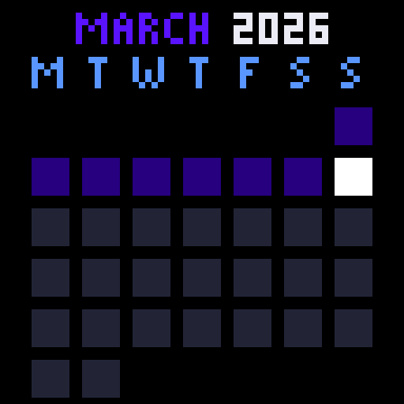 |

Small wins and a completed week get a short celebration, sent to the panel as a sequence of stills:

| Workout win | Sleep win | Week done |
|---|---|---|
| 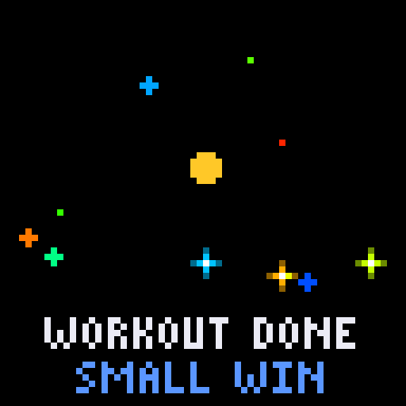 | 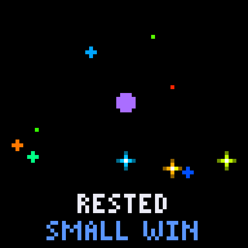 | 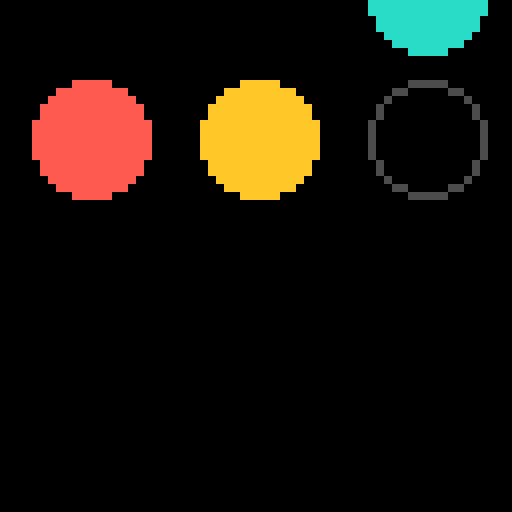 |

The LAN preview page shows every screen at 1x through an LED-gamma emulator and at 8x for pixel inspection. Legibility is judged at 1x, never at browser zoom.

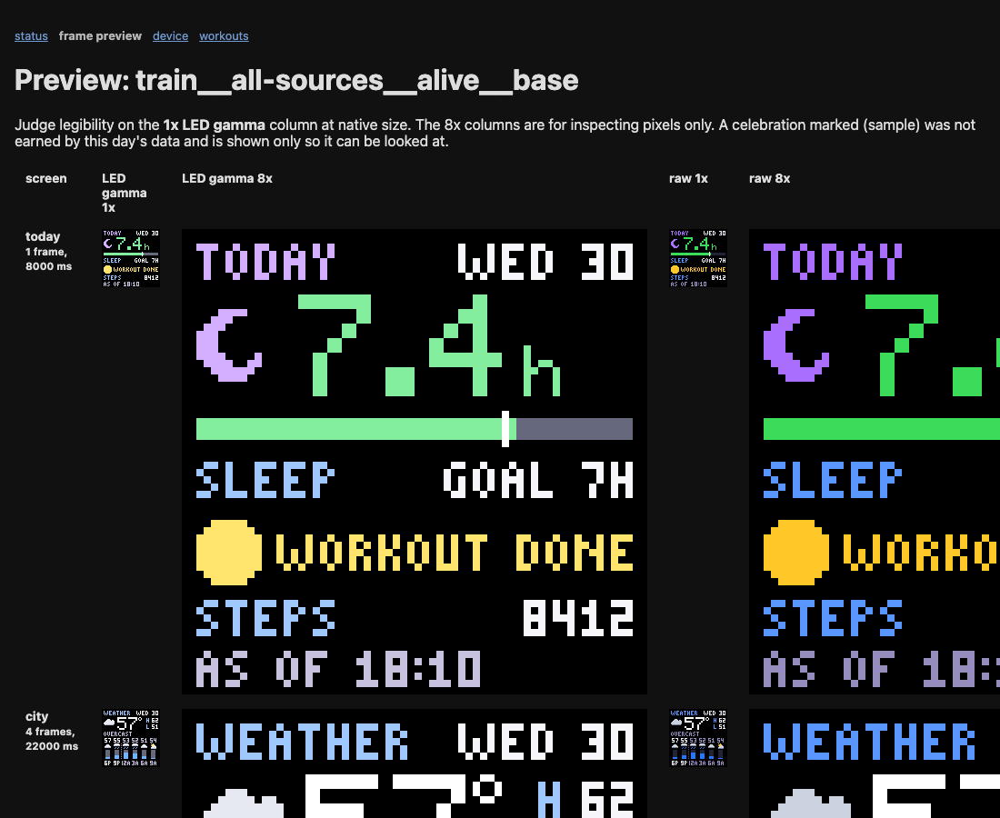

## How it holds together

- **Raw before parsed.** Every inbound payload is archived verbatim before parsing, so every metric can be recomputed from scratch. Replaying the same payloads changes nothing.
- **One canonical activity.** The same workout reported by the Watch and a phone app merges into one record with both provenances kept; no metric counts it twice.
- **Health data stays home.** Raw samples never leave the LAN. The summary call sends daily aggregates only, the month call sends no personal data, and the weather feeds get coordinates rounded to two decimals. An egress test enforces the allowlist.
- **Every displayed number traces to a metrics row.** A grounding gate rejects any model-written line whose numbers are not in its payload.
- **The display never blanks.** Model unavailable or over the monthly budget means rule-based copy, not an empty frame.
- **Day and week boundaries are local time**, Monday to Sunday. A sleep session belongs to the day you wake.
- Gates ship with the mutant that turns them red. Every render cycle uses a new fixture combination (day type × data completeness × streak state × season) so the layout and the voice are tested across the matrix.

## Stack

- Python 3.12, uv, FastAPI, SQLite (stdlib, hand-written migrations), APScheduler, httpx, Pillow, pytest, ruff.
- Anthropic SDK for the daily line, the month feature, and a heart-rate "coach" that can credit a sustained effort the feed missed. Model ids and the monthly cap live in `config.toml`.
- Runs on a Mac under launchd today; a Raspberry Pi guide is in `additional/`.
- Personal project, single user, no auth. Not a product.
